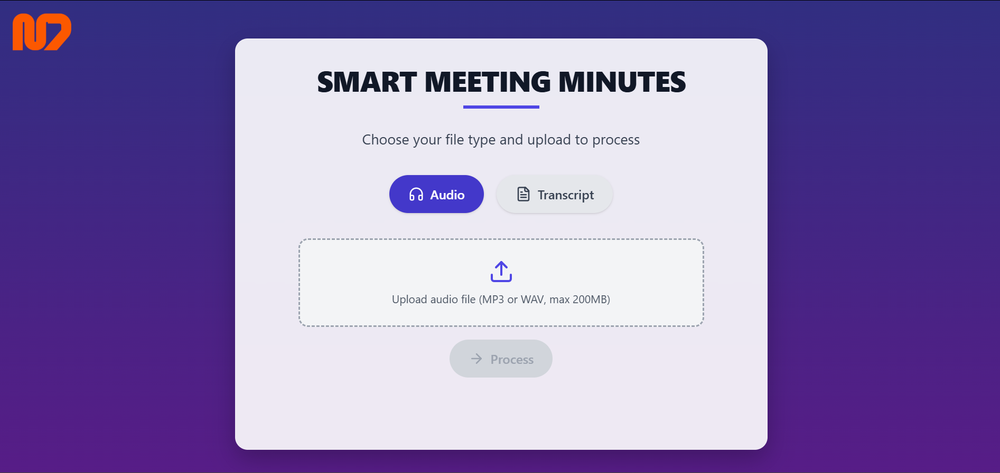

# 📝 Smart Meeting Minutes

**Smart Meeting Minutes** is an intelligent web application that automatically generates professional *Minutes of Meeting (MoM)* from uploaded **audio** or **transcript** files. It uses **speaker diarization**, **OpenAI Whisper for transcription**, and **GPT-3.5-turbo for MoM generation**.

---

## 🔧 Features

* 🎙️ Upload **audio files** (`.mp3`, `.wav`) and get speaker-labeled transcriptions.
* 📄 Upload **text transcripts** (`.txt`) directly for faster processing.
* 🧠 Utilizes **Whisper** for speech-to-text and **PyAnnote** for speaker diarization.
* ✨ Generates well-formatted and professional MoM using **OpenAI GPT**.
* ⚡ Supports parallel processing for faster diarization.
* 💻 Interactive frontend built with **React + TailwindCSS**.

---

## 🖼️ UI Preview



---

## 🚀 Getting Started

### 1. Clone the repository

```bash
git clone https://github.com/yourusername/SmartMeetingMinutes.git
cd SmartMeetingMinutes
```

### 2. Backend Setup

#### ✅ Prerequisites

* Python 3.8+
* FFmpeg (required by `pydub`)
* CUDA GPU (recommended for PyAnnote + Whisper)
* Install system dependencies:

  ```bash
  sudo apt install ffmpeg
  ```

#### 📦 Install Python dependencies

```bash
python -m venv venv
source venv/bin/activate
pip install -r requirements.txt
```

#### 🔐 Setup `.env`

Create a `.env` file in the root directory:

```env
OPENAI_API_KEY=your_openai_api_key
HUGGINGFACE_API_KEY=your_huggingface_token
```

#### ▶️ Run Flask server

```bash
python main.py
```

Server runs on `http://0.0.0.0:8785`

---

### 3. Frontend Setup

#### 📦 Install dependencies

```bash
npm install
```

#### ▶️ Run the React app

```bash
npm run dev
```

By default, React runs on `http://localhost:5173`.

---

## 🔗 API Endpoint

### `POST /upload`

* Accepts audio (`.wav`, `.mp3`) or transcript (`.txt`) file.
* Returns JSON with auto-generated MoM.

**Request:**

```bash
curl -X POST http://localhost:8785/upload \
  -F 'file=@meeting.wav' \
  -F 'file_type=audio'
```

**Response:**

```json
{
  "mom": "Here are the minutes of the meeting..."
}
```

---

## 🧠 Tech Stack

| Layer      | Stack                                |
| ---------- | ------------------------------------ |
| Backend    | Flask, Whisper, PyAnnote, OpenAI API |
| Frontend   | React, TypeScript, TailwindCSS       |
| Deployment | Works locally; can be containerized  |

---

## 🛠️ To Do

* [ ] Dockerize backend and frontend
* [ ] Add authentication and usage logs
* [ ] Add speaker labeling in frontend display
* [ ] Add support for multi-language audio transcription

---

## 🙌 Acknowledgements

* [OpenAI Whisper](https://github.com/openai/whisper)
* [pyannote-audio](https://github.com/pyannote/pyannote-audio)
* [TailwindCSS](https://tailwindcss.com/)
* [OpenAI GPT Models](https://platform.openai.com/docs)
